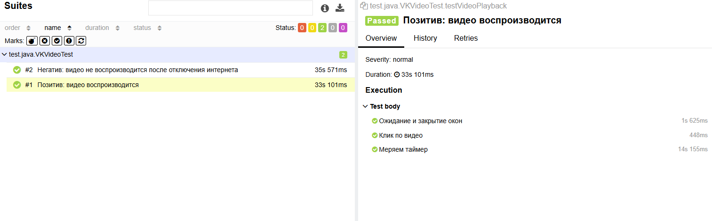
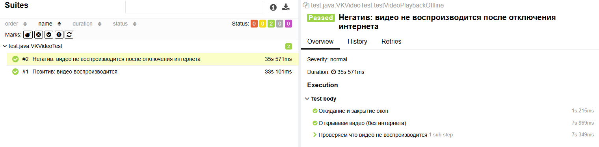

# Автоматизация тестирования приложения VK Видео (Android)

Проект представляет набор тестов для мобильного приложения **VK Видео**.
## Технологический стек

* **Java 22** — основной язык разработки.
* **Appium 2.0 (UiAutomator2)** — драйвер для управления Android-устройством.
* **JUnit 5** — фреймворк для организации и запуска тестов.
* **Maven** — сборка проекта и управление зависимостями.
* **Allure** — генерация подробных отчетов с шагами и скриншотами.

---

## Описание 

### 1. Тест воспроизведения видео (`testVideoPlayback`)
* **Цель**: Убедиться, что выбранное видео успешно загружается и проигрывается.
* **Логика**:
    * Прохождение авторизации/закрытие стартовых окон.
    * Выбор видео из ленты.
    * Сравнение текста таймера (`current_progress`) с интервалом в 4 секунды.
    * **Ожидаемый результат**: Время на таймере должно увеличиться.

### 2. Тест отсутствия интернета (`testVideoPlaybackOffline`)
* **Цель**: Проверить реакцию плеера на обрыв соединения.
* **Логика**:
    * Отключение Wi-Fi и мобильных данных через `adb shell`.
    * Поиск индикатора загрузки (круглый спиннер `progress_view`).
    * Проверка того, что время воспроизведения замерло.
* **Ожидаемый результат**: Появление бесконечной загрузки или остановка таймера.

---

## Архитектура проекта

* **BaseTest.java** — базовый класс с настройками драйвера, логикой переключения сети (Airplane Mode) и методами проверки таймера.
* **VKVideoTest.java** — тестовые сценарии.
---

## Запуск тестов
1. Запуск эмулятора Android через Android Studio.
2. Запуск Appium сервер в терминале:
   `appium`
3. `mvn clean test`
## Отчет
   `allure serve target/allure-results`

